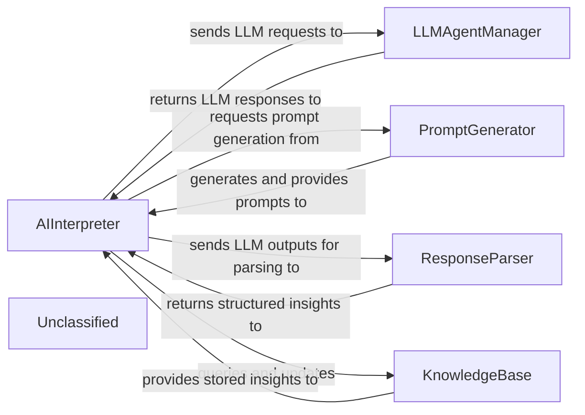

## Details

The AI Interpretation Layer serves as the intelligent core of the system, responsible for processing various inputs to generate architectural insights. The `AIInterpreter` acts as the central orchestrator, coordinating the flow of information and tasks. It leverages the `PromptGenerator` to craft context-rich prompts based on static analysis data and code diffs. These prompts are then sent to the `LLMAgentManager`, which handles the complexities of interacting with diverse LLM providers, ensuring efficient and reliable communication. Upon receiving responses from the LLMs, the `AIInterpreter` forwards them to the `ResponseParser` for validation, extraction, and transformation into structured architectural insights. Finally, the `KnowledgeBase` is utilized by the `AIInterpreter` to store and retrieve past insights, enhancing the accuracy and consistency of future analyses. This layered approach ensures a modular, scalable, and maintainable architecture for AI-driven architectural analysis.

### AIInterpreter
The core intelligence component, orchestrating the entire AI interpretation process. It receives input data (static analysis, code diffs), selects and invokes LLM agents, manages prompt generation, parses LLM responses, and ultimately generates architectural insights.

**Related Classes/Methods**:

- `AIInterpreter`

### LLMAgentManager
Manages interactions with various LLM providers (e.g., OpenAI, Anthropic, Google Gemini, AWS Bedrock, Ollama). It handles configuration loading, request routing, API key management, authentication, retry mechanisms, and rate limiting, abstracting these complexities from the `AIInterpreter`.

**Related Classes/Methods**:

### PromptGenerator
Responsible for dynamically constructing effective and context-rich prompts for the LLMs. It integrates static analysis data, code diffs, and specific task instructions to formulate queries that yield relevant architectural insights.

**Related Classes/Methods**:

### ResponseParser
Parses, validates, and extracts structured information from the raw outputs received from the LLMs. It handles potential errors, malformed responses, and transforms the LLM's natural language output into a usable format for architectural insights.

**Related Classes/Methods**:

### KnowledgeBase
Stores and retrieves previously generated insights, architectural patterns, or domain-specific knowledge. This component helps improve the consistency, accuracy, and efficiency of future interpretations by leveraging past analyses.

**Related Classes/Methods**:

### Unclassified
Component for all unclassified files and utility functions (Utility functions/External Libraries/Dependencies)

**Related Classes/Methods**: _None_

### [FAQ](https://github.com/CodeBoarding/GeneratedOnBoardings/tree/main?tab=readme-ov-file#faq)
