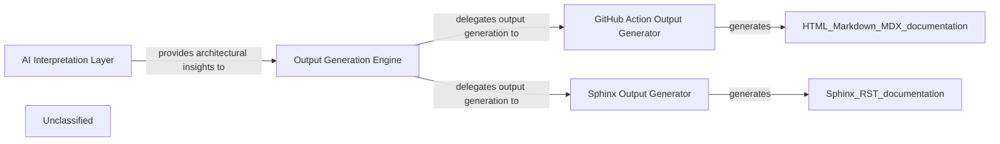

## Details

The system begins with the AI Interpretation Layer, which processes raw information and generates detailed architectural insights. These insights are then fed into the Output Generation Engine, the central orchestrator responsible for managing the documentation creation process. The Output Generation Engine delegates the actual generation of specific documentation formats to specialized components. For GitHub Actions environments, the GitHub Action Output Generator creates HTML, Markdown, and MDX outputs. For projects requiring comprehensive, versioned documentation, the Sphinx Output Generator produces Sphinx-compatible (RST) documentation. This architecture ensures a clear separation of concerns, allowing for flexible and extensible documentation generation tailored to various deployment and consumption needs.

### AI Interpretation Layer [[Expand]](./AI_Interpretation_Layer.md)
This layer is responsible for processing raw information and generating comprehensive architectural insights. It leverages advanced AI prompting mechanisms to derive structured understanding, which serves as the foundational input for all subsequent documentation generation.

**Related Classes/Methods**:

- <a href="https://github.com/CodeBoarding/CodeBoarding/blob/mainagents/prompts/gpt_prompts_bidirectional.py" target="_blank" rel="noopener noreferrer">`agents.prompts.gpt_prompts_bidirectional`</a>
- <a href="https://github.com/CodeBoarding/CodeBoarding/blob/mainagents/prompts/gpt_prompts_unidirectional.py" target="_blank" rel="noopener noreferrer">`agents.prompts.gpt_prompts_unidirectional`</a>
- <a href="https://github.com/CodeBoarding/CodeBoarding/blob/mainagents/prompts/prompt_factory.py" target="_blank" rel="noopener noreferrer">`agents.prompts.prompt_factory`</a>

### Output Generation Engine [[Expand]](./Output_Generation_Engine.md)
Acts as the central orchestrator for the entire output generation process. It receives architectural insights from the AI Interpretation Layer, delegates to specific format generators, and manages the overall flow of documentation creation and delivery. This component is central due to its role in coordinating all output activities and integrating with upstream (AI Interpretation Layer) and downstream (specific output generators) components.

**Related Classes/Methods**:

- <a href="https://github.com/CodeBoarding/CodeBoarding/blob/maingithub_action.py" target="_blank" rel="noopener noreferrer">`github_action.generate_analysis`</a>

### GitHub Action Output Generator
Specializes in generating documentation outputs tailored for GitHub Actions workflows. It handles the creation of HTML, Markdown, and MDX formats, ensuring compatibility and proper structuring for automated deployment within a GitHub Actions environment. This component is crucial for enabling automated documentation updates and integration into CI/CD pipelines.

**Related Classes/Methods**:

- <a href="https://github.com/CodeBoarding/CodeBoarding/blob/maingithub_action.py" target="_blank" rel="noopener noreferrer">`github_action.generate_html`</a>
- <a href="https://github.com/CodeBoarding/CodeBoarding/blob/maingithub_action.py" target="_blank" rel="noopener noreferrer">`github_action.generate_markdown`</a>
- <a href="https://github.com/CodeBoarding/CodeBoarding/blob/maingithub_action.py" target="_blank" rel="noopener noreferrer">`github_action.generate_mdx`</a>

### Sphinx Output Generator
Focuses exclusively on generating documentation in the Sphinx format. It processes the architectural insights and renders them into the structured and extensible format required by Sphinx, including reStructuredText or MyST Markdown. This component is vital for projects requiring comprehensive, versioned, and highly customizable documentation.

**Related Classes/Methods**:

- <a href="https://github.com/CodeBoarding/CodeBoarding/blob/mainoutput_generators/sphinx.py" target="_blank" rel="noopener noreferrer">`output_generators.sphinx.generate_rst_file`</a>

### Unclassified
Component for all unclassified files and utility functions (Utility functions/External Libraries/Dependencies)

**Related Classes/Methods**: _None_

### [FAQ](https://github.com/CodeBoarding/GeneratedOnBoardings/tree/main?tab=readme-ov-file#faq)
