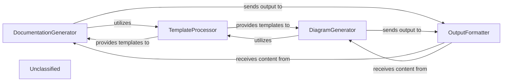

## Details

The core of this subsystem revolves around transforming structured architectural data into human-readable documentation and machine-readable diagram definitions. The DocumentationGenerator and DiagramGenerator components act as the primary orchestrators, leveraging a TemplateProcessor to ensure consistent formatting and a dedicated OutputFormatter to finalize the generated content. This structured approach ensures that both textual explanations and visual representations of the codebase are accurate, consistent, and adhere to defined standards.

### DocumentationGenerator
Responsible for generating human-readable documentation in formats like Markdown. It takes structured data and applies templates to produce coherent textual explanations of the codebase and architecture.

**Related Classes/Methods**:

- <a href="https://github.com/CodeBoarding/CodeBoarding/blob/mainoutput_generators/markdown.py#L42-L89" target="_blank" rel="noopener noreferrer">`output_generators.markdown.MarkdownGenerator`:42-89</a>

### DiagramGenerator
Creates machine-readable diagram definitions, likely in a format suitable for rendering by tools like Mermaid.js. It translates architectural relationships and structures into a visual representation.

**Related Classes/Methods**:

### TemplateProcessor
A utility component that manages and applies various templates to ensure consistency in the generated documentation and diagrams.

**Related Classes/Methods**:

- `template_processor.TemplateProcessor`

### OutputFormatter
Ensures that the final generated output (Markdown and JSON) adheres to specified quality standards, syntax, and formatting rules before persistence.

**Related Classes/Methods**:

- `output_formatter.OutputFormatter`

### Unclassified
Component for all unclassified files and utility functions (Utility functions/External Libraries/Dependencies)

**Related Classes/Methods**: _None_

### [FAQ](https://github.com/CodeBoarding/GeneratedOnBoardings/tree/main?tab=readme-ov-file#faq)
