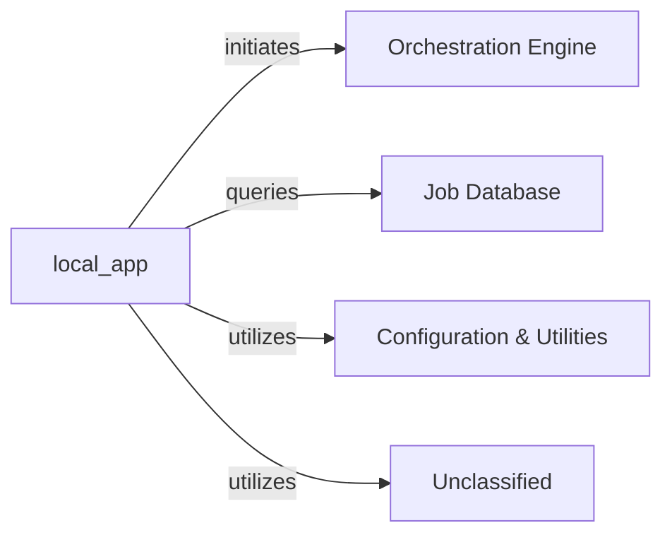

## Details

The system's architecture is centered around the `local_app` component, which acts as the primary API Gateway, managing all external client interactions. It orchestrates analysis workflows by initiating tasks with the `Orchestration Engine` and monitors their progress by querying the `Job Database`. For operational parameters and common functionalities, `local_app` leverages shared services from `Configuration & Utilities`. The system also incorporates an `Unclassified` component, which has recently evolved to include an expanded `repo_utils` package with enhanced utilities, particularly for git diff functionalities, and updated GPT prompt definitions within `agents/prompts`, significantly influencing agent behavior. This `Unclassified` component provides essential underlying functionalities utilized by `local_app` and potentially other parts of the system.

### local_app
This component serves as the concrete implementation of the API Gateway, handling all external interactions. It is responsible for processing requests from various clients, initiating analysis workflows, querying job statuses, and utilizing shared services for operational parameters and common functions.

**Related Classes/Methods**:

- <a href="https://github.com/CodeBoarding/CodeBoarding/blob/mainlocal_app.py" target="_blank" rel="noopener noreferrer">`local_app`</a>

### Orchestration Engine
Responsible for initiating and managing analysis workflows as requested by the `local_app` component.

**Related Classes/Methods**:

### Job Database
Stores and provides persistent storage for job statuses and related data, which can be queried by the `local_app` component.

**Related Classes/Methods**:

- `JobDatabase`:1-10

### Configuration & Utilities
Provides shared services, operational parameters, and common utility functions utilized across various components, including `local_app`.

**Related Classes/Methods**:

- `ConfigurationAndUtilities`

### Unclassified
This component encompasses various utility functions, external libraries, and dependencies. It now includes an expanded and reorganized `repo_utils` package, offering enhanced and more accessible utilities, particularly with refactored git diff functionalities. Additionally, it contains updated and refactored GPT prompt definitions within the `agents/prompts` module, which significantly impacts the behavior and intelligence of agents utilizing these prompts.

**Related Classes/Methods**:

- <a href="https://github.com/CodeBoarding/CodeBoarding/blob/mainrepo_utils" target="_blank" rel="noopener noreferrer">`repo_utils`</a>
- `agents.prompts`

### Unclassified
Component for all unclassified files and utility functions (Utility functions/External Libraries/Dependencies)

**Related Classes/Methods**: _None_

### [FAQ](https://github.com/CodeBoarding/GeneratedOnBoardings/tree/main?tab=readme-ov-file#faq)
