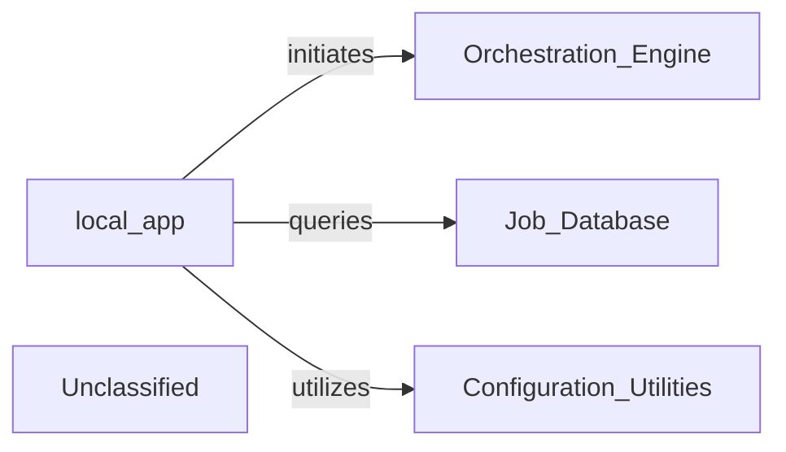

## Details

The system's core functionality revolves around the `local_app` component, which acts as the primary interface for external clients. `local_app` processes incoming requests, and based on these, it initiates complex analysis workflows by interacting with the `Orchestration Engine`. To manage and track the state of these analytical tasks, `local_app` queries the `Job Database` for persistent storage of job-related information. Furthermore, `local_app` relies on the `Configuration & Utilities` component for essential operational settings and shared functionalities, ensuring a consistent and efficient execution environment. This architecture delineates clear responsibilities, with `local_app` managing external interactions, the `Orchestration Engine` orchestrating internal processes, the `Job Database` maintaining state, and `Configuration & Utilities` providing foundational support.

### local_app
This component serves as the concrete implementation of the API Gateway, handling all external interactions. It is responsible for processing requests from various clients, initiating analysis workflows through the Orchestration Engine, querying job statuses from the Job Database, and utilizing shared services from Configuration & Utilities for operational parameters and common functions.

**Related Classes/Methods**:

- <a href="https://github.com/CodeBoarding/CodeBoarding/blob/mainlocal_app.py" target="_blank" rel="noopener noreferrer">`local_app`</a>

### Unclassified
Component for all unclassified files and utility functions (Utility functions/External Libraries/Dependencies)

**Related Classes/Methods**: _None_

### [FAQ](https://github.com/CodeBoarding/GeneratedOnBoardings/tree/main?tab=readme-ov-file#faq)
