```mermaid
graph LR
    User_Interface_API_Gateway["User Interface / API Gateway"]
    Job_Management_Persistence["Job Management & Persistence"]
    Code_Repository_Access["Code Repository Access"]
    Static_Analysis_Engine["Static Analysis Engine"]
    AI_Interpretation_Layer["AI Interpretation Layer"]
    Output_Generation_Engine["Output Generation Engine"]
    Unclassified["Unclassified"]
    Unclassified["Unclassified"]
    User_Interface_API_Gateway -- "initiates & manages jobs" --> Job_Management_Persistence
    User_Interface_API_Gateway -- "triggers repository operations" --> Code_Repository_Access
    Job_Management_Persistence -- "provides job status" --> User_Interface_API_Gateway
    Code_Repository_Access -- "provides source code" --> Static_Analysis_Engine
    Code_Repository_Access -- "provides code diffs" --> AI_Interpretation_Layer
    Static_Analysis_Engine -- "outputs static analysis data" --> AI_Interpretation_Layer
    AI_Interpretation_Layer -- "requests file content" --> Code_Repository_Access
    AI_Interpretation_Layer -- "requests code details" --> Static_Analysis_Engine
    AI_Interpretation_Layer -- "stores analysis results" --> Job_Management_Persistence
    AI_Interpretation_Layer -- "sends architectural insights" --> Output_Generation_Engine
    Output_Generation_Engine -- "provides diagram data & documentation" --> User_Interface_API_Gateway
    click User_Interface_API_Gateway href "https://github.com/CodeBoarding/CodeBoarding/blob/main/.codeboarding/User_Interface_API_Gateway.md" "Details"
    click Job_Management_Persistence href "https://github.com/CodeBoarding/CodeBoarding/blob/main/.codeboarding/Job_Management_Persistence.md" "Details"
    click Static_Analysis_Engine href "https://github.com/CodeBoarding/CodeBoarding/blob/main/.codeboarding/Static_Analysis_Engine.md" "Details"
    click AI_Interpretation_Layer href "https://github.com/CodeBoarding/CodeBoarding/blob/main/.codeboarding/AI_Interpretation_Layer.md" "Details"
    click Output_Generation_Engine href "https://github.com/CodeBoarding/CodeBoarding/blob/main/.codeboarding/Output_Generation_Engine.md" "Details"
```

## Details

The system is structured around a core `AI Interpretation Layer` that orchestrates code analysis. User interactions, managed by the `User Interface / API Gateway`, initiate jobs whose states are persistently tracked by `Job Management & Persistence`. Source code is acquired and managed by `Code Repository Access`, providing raw code and diffs to both the `Static Analysis Engine` for structural analysis and directly to the `AI Interpretation Layer`. The `AI Interpretation Layer` synthesizes information from static analysis and code changes, leveraging LLMs to generate architectural insights. These insights are then transformed into diagrams and documentation by the `Output Generation Engine` before being presented back to the user via the `User Interface / API Gateway`. This modular design ensures clear separation of concerns, facilitating maintainability and scalability.

### User Interface / API Gateway [[Expand]](./User_Interface_API_Gateway.md)
The primary entry point for users and external systems, orchestrating job creation and providing analysis results.

**Related Classes/Methods**:

### Job Management & Persistence [[Expand]](./Job_Management_Persistence.md)
Manages the state and history of all analysis tasks, ensuring persistence of job data.

**Related Classes/Methods**:

### Code Repository Access
Responsible for fetching and managing source code from repositories, including generating code diffs.

**Related Classes/Methods**:

- `CodeRepository`:1-10

### Static Analysis Engine [[Expand]](./Static_Analysis_Engine.md)
Performs structural analysis of source code and provides findings to the AI Interpretation Layer.

**Related Classes/Methods**:

- <a href="https://github.com/CodeBoarding/CodeBoarding/blob/mainstatic_analyzer/__init__.py#L44-L67" target="_blank" rel="noopener noreferrer">`StaticAnalyzer`:44-67</a>

### AI Interpretation Layer [[Expand]](./AI_Interpretation_Layer.md)
The core intelligence component, leveraging static analysis data and code diffs to generate architectural insights using LLM agents.

**Related Classes/Methods**:

- `AIInterpreter`

### Output Generation Engine [[Expand]](./Output_Generation_Engine.md)
Transforms architectural insights into consumable documentation and diagrams.

**Related Classes/Methods**:

- `OutputGenerator`

### Unclassified
Component for all unclassified files and utility functions (Utility functions/External Libraries/Dependencies)

**Related Classes/Methods**: _None_

### Unclassified
Component for all unclassified files and utility functions (Utility functions/External Libraries/Dependencies)

**Related Classes/Methods**: _None_

### [FAQ](https://github.com/CodeBoarding/GeneratedOnBoardings/tree/main?tab=readme-ov-file#faq)
