```mermaid
graph LR
    User_Interface_API_Gateway["User Interface / API Gateway"]
    Job_Management_Persistence["Job Management & Persistence"]
    Code_Repository_Access["Code Repository Access"]
    Static_Analysis_Engine["Static Analysis Engine"]
    AI_Interpretation_Layer["AI Interpretation Layer"]
    Output_Generation_Engine["Output Generation Engine"]
    Unclassified["Unclassified"]
    Unclassified["Unclassified"]
    User_Interface_API_Gateway -- "initiates & manages jobs" --> Job_Management_Persistence
    User_Interface_API_Gateway -- "triggers repository operations" --> Code_Repository_Access
    Job_Management_Persistence -- "provides job status" --> User_Interface_API_Gateway
    Code_Repository_Access -- "provides source code" --> Static_Analysis_Engine
    Code_Repository_Access -- "provides code diffs" --> AI_Interpretation_Layer
    Static_Analysis_Engine -- "outputs static analysis data" --> AI_Interpretation_Layer
    AI_Interpretation_Layer -- "requests file content" --> Code_Repository_Access
    AI_Interpretation_Layer -- "requests code details" --> Static_Analysis_Engine
    AI_Interpretation_Layer -- "stores analysis results" --> Job_Management_Persistence
    AI_Interpretation_Layer -- "sends architectural insights" --> Output_Generation_Engine
    Output_Generation_Engine -- "provides diagram data & documentation" --> User_Interface_API_Gateway
    click User_Interface_API_Gateway href "https://github.com/CodeBoarding/CodeBoarding/blob/main/.codeboarding/User_Interface_API_Gateway.md" "Details"
    click Job_Management_Persistence href "https://github.com/CodeBoarding/CodeBoarding/blob/main/.codeboarding/Job_Management_Persistence.md" "Details"
    click Static_Analysis_Engine href "https://github.com/CodeBoarding/CodeBoarding/blob/main/.codeboarding/Static_Analysis_Engine.md" "Details"
    click AI_Interpretation_Layer href "https://github.com/CodeBoarding/CodeBoarding/blob/main/.codeboarding/AI_Interpretation_Layer.md" "Details"
    click Output_Generation_Engine href "https://github.com/CodeBoarding/CodeBoarding/blob/main/.codeboarding/Output_Generation_Engine.md" "Details"
```

## Details

The CodeBoarding project is structured around a core AI Interpretation Layer that orchestrates the analysis of source code to generate architectural insights and documentation. User interactions, whether through a local application, VS Code extension, or GitHub Actions, are managed by the User Interface / API Gateway, which initiates and monitors analysis jobs. These jobs are persisted and managed by the Job Management & Persistence component. The AI Interpretation Layer relies on the Code Repository Access for fetching code and diffs, and the Static Analysis Engine for detailed code structure analysis. Finally, the Output Generation Engine transforms the AI-derived insights into various documentation and diagram formats, which are then presented back to the user via the User Interface / API Gateway.

### User Interface / API Gateway [[Expand]](./User_Interface_API_Gateway.md)
The external-facing layer for users and integrations (VS Code, GitHub Actions, local CLI) to interact with the system. It initiates analysis jobs and retrieves results.

**Related Classes/Methods**:

- <a href="https://github.com/CodeBoarding/CodeBoarding/blob/mainlocal_app.py" target="_blank" rel="noopener noreferrer">`local_app`</a>

### Job Management & Persistence
Manages the lifecycle and state of all analysis jobs, storing job metadata, progress, and final results in a persistent database.

**Related Classes/Methods**:

- <a href="https://github.com/CodeBoarding/CodeBoarding/blob/mainduckdb_crud.py" target="_blank" rel="noopener noreferrer">`duckdb_crud`</a>

### Code Repository Access
Provides an interface for interacting with source code repositories, including cloning, fetching updates, and generating code differences.

**Related Classes/Methods**:

- <a href="https://github.com/CodeBoarding/CodeBoarding/blob/mainrepo_utils/git_diff.py" target="_blank" rel="noopener noreferrer">`repo_utils.git_diff`</a>

### Static Analysis Engine [[Expand]](./Static_Analysis_Engine.md)
Performs deep structural analysis of source code using Language Server Protocol (LSP) clients to extract symbols, call graphs, class hierarchies, and dependencies.

**Related Classes/Methods**:

- <a href="https://github.com/CodeBoarding/CodeBoarding/blob/mainstatic_analyzer/scanner.py" target="_blank" rel="noopener noreferrer">`static_analyzer.scanner`</a>

### AI Interpretation Layer [[Expand]](./AI_Interpretation_Layer.md)
The core intelligence layer, managing interactions with Large Language Models (LLMs) through a framework of specialized agents. It orchestrates the flow of information between static analysis and LLM interpretation to generate architectural insights, detailed analysis, validation, and diff analysis.

**Related Classes/Methods**:

- <a href="https://github.com/CodeBoarding/CodeBoarding/blob/mainagents/abstraction_agent.py" target="_blank" rel="noopener noreferrer">`agents.abstraction_agent.AbstractionAgent`</a>

### Output Generation Engine [[Expand]](./Output_Generation_Engine.md)
Transforms the structured architectural insights into a format suitable for various diagramming libraries and tools, and renders them into human-readable and machine-consumable documentation formats.

**Related Classes/Methods**:

- <a href="https://github.com/CodeBoarding/CodeBoarding/blob/maindiagram_analysis/diagram_generator.py" target="_blank" rel="noopener noreferrer">`diagram_analysis.diagram_generator`</a>

### Unclassified
Component for all unclassified files and utility functions (Utility functions/External Libraries/Dependencies)

**Related Classes/Methods**: _None_

### [FAQ](https://github.com/CodeBoarding/GeneratedOnBoardings/tree/main?tab=readme-ov-file#faq)
