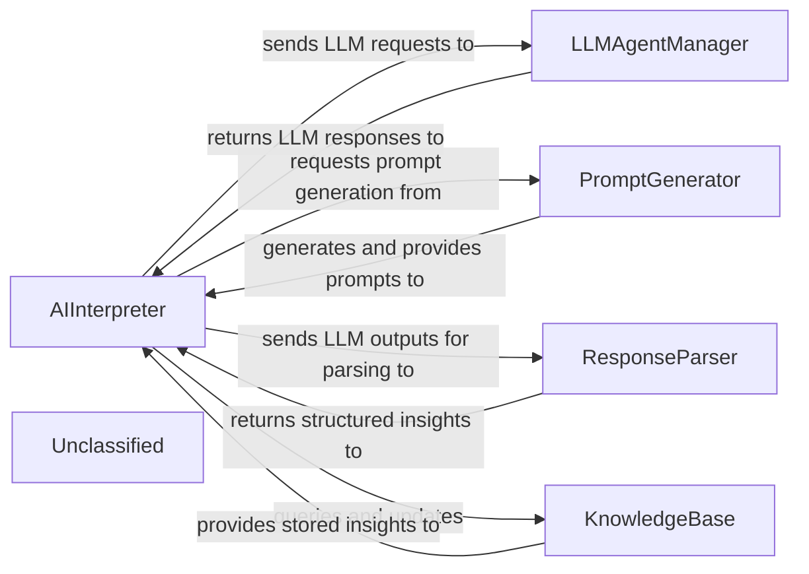
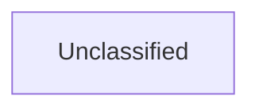
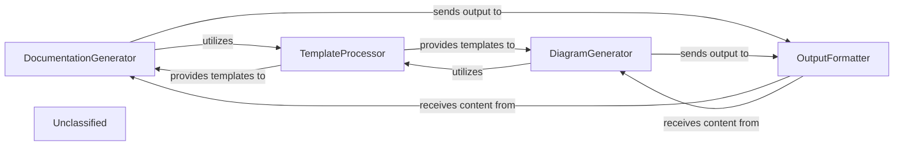
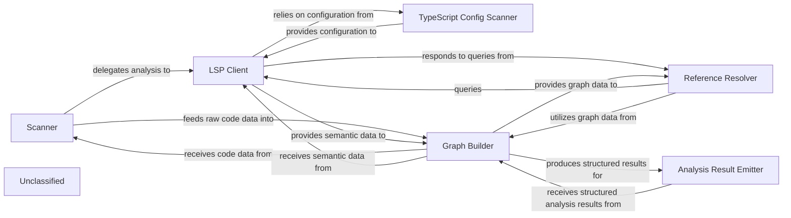
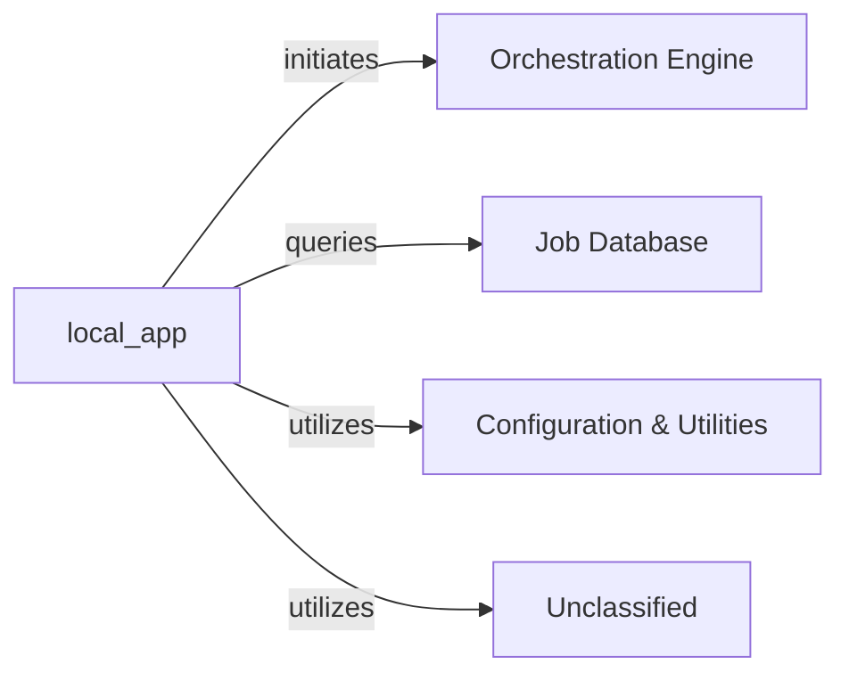

```mermaid
graph LR
    User_Interface_API_Gateway["User Interface / API Gateway"]
    Job_Management_Persistence["Job Management & Persistence"]
    Code_Repository_Access["Code Repository Access"]
    Static_Analysis_Engine["Static Analysis Engine"]
    AI_Interpretation_Layer["AI Interpretation Layer"]
    Output_Generation_Engine["Output Generation Engine"]
    Unclassified["Unclassified"]
    Unclassified["Unclassified"]
    User_Interface_API_Gateway -- "initiates & manages jobs" --> Job_Management_Persistence
    User_Interface_API_Gateway -- "triggers repository operations" --> Code_Repository_Access
    Job_Management_Persistence -- "provides job status" --> User_Interface_API_Gateway
    Code_Repository_Access -- "provides source code" --> Static_Analysis_Engine
    Code_Repository_Access -- "provides code diffs" --> AI_Interpretation_Layer
    Static_Analysis_Engine -- "outputs static analysis data" --> AI_Interpretation_Layer
    AI_Interpretation_Layer -- "requests file content" --> Code_Repository_Access
    AI_Interpretation_Layer -- "requests code details" --> Static_Analysis_Engine
    AI_Interpretation_Layer -- "stores analysis results" --> Job_Management_Persistence
    AI_Interpretation_Layer -- "sends architectural insights" --> Output_Generation_Engine
    Output_Generation_Engine -- "provides diagram data & documentation" --> User_Interface_API_Gateway
    click User_Interface_API_Gateway href "https://github.com/CodeBoarding/CodeBoarding/blob/main/.codeboarding/User_Interface_API_Gateway.md" "Details"
    click Job_Management_Persistence href "https://github.com/CodeBoarding/CodeBoarding/blob/main/.codeboarding/Job_Management_Persistence.md" "Details"
    click Static_Analysis_Engine href "https://github.com/CodeBoarding/CodeBoarding/blob/main/.codeboarding/Static_Analysis_Engine.md" "Details"
    click AI_Interpretation_Layer href "https://github.com/CodeBoarding/CodeBoarding/blob/main/.codeboarding/AI_Interpretation_Layer.md" "Details"
    click Output_Generation_Engine href "https://github.com/CodeBoarding/CodeBoarding/blob/main/.codeboarding/Output_Generation_Engine.md" "Details"
```

## Details

The AI Interpretation Layer serves as the intelligent core of the system, responsible for processing various inputs to generate architectural insights. The `AIInterpreter` acts as the central orchestrator, coordinating the flow of information and tasks. It leverages the `PromptGenerator` to craft context-rich prompts based on static analysis data and code diffs. These prompts are then sent to the `LLMAgentManager`, which handles the complexities of interacting with diverse LLM providers, ensuring efficient and reliable communication. Upon receiving responses from the LLMs, the `AIInterpreter` forwards them to the `ResponseParser` for validation, extraction, and transformation into structured architectural insights. Finally, the `KnowledgeBase` is utilized by the `AIInterpreter` to store and retrieve past insights, enhancing the accuracy and consistency of future analyses. This layered approach ensures a modular, scalable, and maintainable architecture for AI-driven architectural analysis.

### AIInterpreter
The core intelligence component, orchestrating the entire AI interpretation process. It receives input data (static analysis, code diffs), selects and invokes LLM agents, manages prompt generation, parses LLM responses, and ultimately generates architectural insights.

**Related Classes/Methods**:

- `AIInterpreter`

### LLMAgentManager
Manages interactions with various LLM providers (e.g., OpenAI, Anthropic, Google Gemini, AWS Bedrock, Ollama). It handles configuration loading, request routing, API key management, authentication, retry mechanisms, and rate limiting, abstracting these complexities from the `AIInterpreter`.

**Related Classes/Methods**:

### PromptGenerator
Responsible for dynamically constructing effective and context-rich prompts for the LLMs. It integrates static analysis data, code diffs, and specific task instructions to formulate queries that yield relevant architectural insights.

**Related Classes/Methods**:

### ResponseParser
Parses, validates, and extracts structured information from the raw outputs received from the LLMs. It handles potential errors, malformed responses, and transforms the LLM's natural language output into a usable format for architectural insights.

**Related Classes/Methods**:

### KnowledgeBase
Stores and retrieves previously generated insights, architectural patterns, or domain-specific knowledge. This component helps improve the consistency, accuracy, and efficiency of future interpretations by leveraging past analyses.

**Related Classes/Methods**:

### Unclassified
Component for all unclassified files and utility functions (Utility functions/External Libraries/Dependencies)

**Related Classes/Methods**: _None_

### [FAQ](https://github.com/CodeBoarding/GeneratedOnBoardings/tree/main?tab=readme-ov-file#faq)

## Details

The feedback highlights that the identified components (JobManager, PersistenceLayer, QueueingMechanism, OrchestrationEngine, APIServiceGateway, OutputGenerationEngine) have incorrect references, as no such modules, functions, or classes exist in the project. The `getFileStructure` output reveals a `.codeboarding` directory containing several `.json` and `.md` files, which likely hold architectural descriptions. To address the feedback, I will first examine the `overview.md` file within the `.codeboarding` directory to gain a high-level understanding of the project's architecture and then investigate other `.md` files for specific component definitions. This approach will help in identifying the correct references for the conceptual components.

### Unclassified
Component for all unclassified files and utility functions (Utility functions/External Libraries/Dependencies)

**Related Classes/Methods**: _None_

### [FAQ](https://github.com/CodeBoarding/GeneratedOnBoardings/tree/main?tab=readme-ov-file#faq)

## Details

The core of this subsystem revolves around transforming structured architectural data into human-readable documentation and machine-readable diagram definitions. The DocumentationGenerator and DiagramGenerator components act as the primary orchestrators, leveraging a TemplateProcessor to ensure consistent formatting and a dedicated OutputFormatter to finalize the generated content. This structured approach ensures that both textual explanations and visual representations of the codebase are accurate, consistent, and adhere to defined standards.

### DocumentationGenerator
Responsible for generating human-readable documentation in formats like Markdown. It takes structured data and applies templates to produce coherent textual explanations of the codebase and architecture.

**Related Classes/Methods**:

- <a href="https://github.com/CodeBoarding/CodeBoarding/blob/mainoutput_generators/markdown.py#L42-L89" target="_blank" rel="noopener noreferrer">`output_generators.markdown.MarkdownGenerator`:42-89</a>

### DiagramGenerator
Creates machine-readable diagram definitions, likely in a format suitable for rendering by tools like Mermaid.js. It translates architectural relationships and structures into a visual representation.

**Related Classes/Methods**:

### TemplateProcessor
A utility component that manages and applies various templates to ensure consistency in the generated documentation and diagrams.

**Related Classes/Methods**:

- `template_processor.TemplateProcessor`

### OutputFormatter
Ensures that the final generated output (Markdown and JSON) adheres to specified quality standards, syntax, and formatting rules before persistence.

**Related Classes/Methods**:

- `output_formatter.OutputFormatter`

### Unclassified
Component for all unclassified files and utility functions (Utility functions/External Libraries/Dependencies)

**Related Classes/Methods**: _None_

### [FAQ](https://github.com/CodeBoarding/GeneratedOnBoardings/tree/main?tab=readme-ov-file#faq)

## Details

The static analysis subsystem is designed to systematically process and understand a codebase. The `Scanner` initiates the analysis by identifying relevant files and programming languages. The `LSP Client` then interacts with language servers to extract rich semantic information, leveraging the `TypeScript Config Scanner` for language-specific configurations. This raw and semantic data is fed into the `Graph Builder`, which constructs various graph representations of the code, such as call graphs. The `Reference Resolver` utilizes these graphs and the `LSP Client` to trace and resolve code references. Finally, the `Analysis Result Emitter` formats the structured analysis results for consumption by other parts of the system, such as an AI interpretation layer. This architecture ensures a comprehensive and extensible approach to static code analysis.

### Scanner
Orchestrates the initial phase of code analysis. It's responsible for traversing the codebase, identifying files for analysis, and initiating the parsing process. It acts as the entry point for feeding raw code into the analysis pipeline.

**Related Classes/Methods**:

- <a href="https://github.com/CodeBoarding/CodeBoarding/blob/mainstatic_analyzer/scanner.py" target="_blank" rel="noopener noreferrer">`static_analyzer.scanner.ProjectScanner`</a>

### LSP Client
Establishes and manages communication with Language Servers (e.g., TypeScript Language Server). It queries language services for Abstract Syntax Trees (ASTs), symbol information, type definitions, and other rich semantic data. The `TypeScript Client` provides specialized capabilities for TypeScript projects.

**Related Classes/Methods**:

- <a href="https://github.com/CodeBoarding/CodeBoarding/blob/mainstatic_analyzer/lsp_client/client.py" target="_blank" rel="noopener noreferrer">`static_analyzer.lsp_client.client.LSPClient`</a>
- <a href="https://github.com/CodeBoarding/CodeBoarding/blob/mainstatic_analyzer/lsp_client/typescript_client.py" target="_blank" rel="noopener noreferrer">`static_analyzer.lsp_client.typescript_client.TypeScriptClient`</a>

### TypeScript Config Scanner
Specifically designed to scan and interpret TypeScript configuration files (e.g., `tsconfig.json`). It extracts crucial project settings, compiler options, and file inclusions/exclusions necessary for accurate TypeScript analysis.

**Related Classes/Methods**:

- <a href="https://github.com/CodeBoarding/CodeBoarding/blob/mainstatic_analyzer/typescript_config_scanner.py#L8-L57" target="_blank" rel="noopener noreferrer">`static_analyzer.typescript_config_scanner.TypeScriptConfigScanner`:8-57</a>

### Graph Builder
Constructs and manages graph-based representations of the source code. This includes building ASTs, Control Flow Graphs (CFGs), and Dependency Graphs from the data provided by the `Scanner` and `LSP Client`. It provides algorithms for graph traversal and querying to enable deep code relationship analysis.

**Related Classes/Methods**:

- <a href="https://github.com/CodeBoarding/CodeBoarding/blob/mainstatic_analyzer/graph.py" target="_blank" rel="noopener noreferrer">`static_analyzer.graph.CallGraph`</a>

### Reference Resolver
Identifies and resolves code references across the codebase. This involves tracing definitions, usages, and relationships between different code entities (e.g., variables, functions, classes). It leverages the LSP client's capabilities and the graph-based code representation.

**Related Classes/Methods**:

- <a href="https://github.com/CodeBoarding/CodeBoarding/blob/mainstatic_analyzer/reference_resolve_mixin.py" target="_blank" rel="noopener noreferrer">`static_analyzer.reference_resolve_mixin.ReferenceResolverMixin`</a>

### Analysis Result Emitter
Responsible for processing and formatting the structured analysis results produced by the `Graph Builder` into a consumable format. This component acts as the interface for external systems to receive the static analysis output.

**Related Classes/Methods**:

- <a href="https://github.com/CodeBoarding/CodeBoarding/blob/mainagents/abstraction_agent.py" target="_blank" rel="noopener noreferrer">`agents.abstraction_agent.AbstractionAgent`</a>

### Unclassified
Component for all unclassified files and utility functions (Utility functions/External Libraries/Dependencies)

**Related Classes/Methods**: _None_

### [FAQ](https://github.com/CodeBoarding/GeneratedOnBoardings/tree/main?tab=readme-ov-file#faq)

## Details

The system's architecture is centered around the `local_app` component, which acts as the primary API Gateway, managing all external client interactions. It orchestrates analysis workflows by initiating tasks with the `Orchestration Engine` and monitors their progress by querying the `Job Database`. For operational parameters and common functionalities, `local_app` leverages shared services from `Configuration & Utilities`. The system also incorporates an `Unclassified` component, which has recently evolved to include an expanded `repo_utils` package with enhanced utilities, particularly for git diff functionalities, and updated GPT prompt definitions within `agents/prompts`, significantly influencing agent behavior. This `Unclassified` component provides essential underlying functionalities utilized by `local_app` and potentially other parts of the system.

### local_app
This component serves as the concrete implementation of the API Gateway, handling all external interactions. It is responsible for processing requests from various clients, initiating analysis workflows, querying job statuses, and utilizing shared services for operational parameters and common functions.

**Related Classes/Methods**:

- <a href="https://github.com/CodeBoarding/CodeBoarding/blob/mainlocal_app.py" target="_blank" rel="noopener noreferrer">`local_app`</a>

### Orchestration Engine
Responsible for initiating and managing analysis workflows as requested by the `local_app` component.

**Related Classes/Methods**:

### Job Database
Stores and provides persistent storage for job statuses and related data, which can be queried by the `local_app` component.

**Related Classes/Methods**:

- `JobDatabase`:1-10

### Configuration & Utilities
Provides shared services, operational parameters, and common utility functions utilized across various components, including `local_app`.

**Related Classes/Methods**:

- `ConfigurationAndUtilities`

### Unclassified
This component encompasses various utility functions, external libraries, and dependencies. It now includes an expanded and reorganized `repo_utils` package, offering enhanced and more accessible utilities, particularly with refactored git diff functionalities. Additionally, it contains updated and refactored GPT prompt definitions within the `agents/prompts` module, which significantly impacts the behavior and intelligence of agents utilizing these prompts.

**Related Classes/Methods**:

- <a href="https://github.com/CodeBoarding/CodeBoarding/blob/mainrepo_utils" target="_blank" rel="noopener noreferrer">`repo_utils`</a>
- `agents.prompts`

### Unclassified
Component for all unclassified files and utility functions (Utility functions/External Libraries/Dependencies)

**Related Classes/Methods**: _None_

### [FAQ](https://github.com/CodeBoarding/GeneratedOnBoardings/tree/main?tab=readme-ov-file#faq)

## Details

The system is structured around a core `AI Interpretation Layer` that orchestrates code analysis. User interactions, managed by the `User Interface / API Gateway`, initiate jobs whose states are persistently tracked by `Job Management & Persistence`. Source code is acquired and managed by `Code Repository Access`, providing raw code and diffs to both the `Static Analysis Engine` for structural analysis and directly to the `AI Interpretation Layer`. The `AI Interpretation Layer` synthesizes information from static analysis and code changes, leveraging LLMs to generate architectural insights. These insights are then transformed into diagrams and documentation by the `Output Generation Engine` before being presented back to the user via the `User Interface / API Gateway`. This modular design ensures clear separation of concerns, facilitating maintainability and scalability.

### User Interface / API Gateway [[Expand]](./User_Interface_API_Gateway.md)
The primary entry point for users and external systems, orchestrating job creation and providing analysis results.

**Related Classes/Methods**:

### Job Management & Persistence [[Expand]](./Job_Management_Persistence.md)
Manages the state and history of all analysis tasks, ensuring persistence of job data.

**Related Classes/Methods**:

### Code Repository Access
Responsible for fetching and managing source code from repositories, including generating code diffs.

**Related Classes/Methods**:

- `CodeRepository`:1-10

### Static Analysis Engine [[Expand]](./Static_Analysis_Engine.md)
Performs structural analysis of source code and provides findings to the AI Interpretation Layer.

**Related Classes/Methods**:

- <a href="https://github.com/CodeBoarding/CodeBoarding/blob/mainstatic_analyzer/__init__.py#L44-L67" target="_blank" rel="noopener noreferrer">`StaticAnalyzer`:44-67</a>

### AI Interpretation Layer [[Expand]](./AI_Interpretation_Layer.md)
The core intelligence component, leveraging static analysis data and code diffs to generate architectural insights using LLM agents.

**Related Classes/Methods**:

- `AIInterpreter`

### Output Generation Engine [[Expand]](./Output_Generation_Engine.md)
Transforms architectural insights into consumable documentation and diagrams.

**Related Classes/Methods**:

- `OutputGenerator`

### Unclassified
Component for all unclassified files and utility functions (Utility functions/External Libraries/Dependencies)

**Related Classes/Methods**: _None_

### Unclassified
Component for all unclassified files and utility functions (Utility functions/External Libraries/Dependencies)

**Related Classes/Methods**: _None_

### [FAQ](https://github.com/CodeBoarding/GeneratedOnBoardings/tree/main?tab=readme-ov-file#faq)

