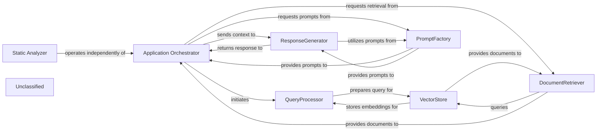
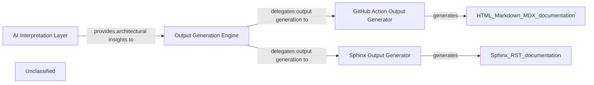
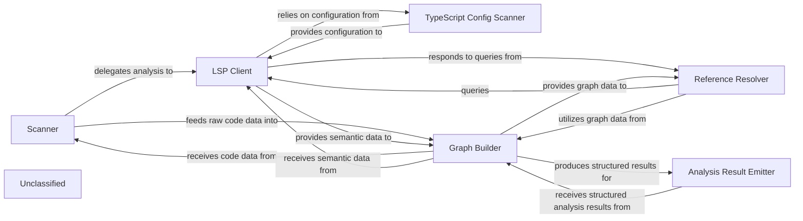
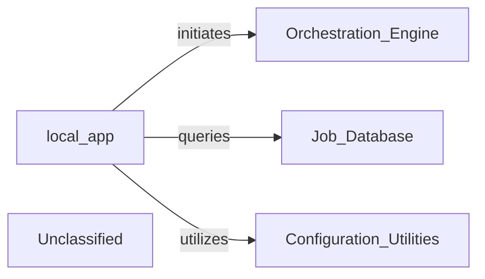

```mermaid
graph LR
    User_Interface_API_Gateway["User Interface / API Gateway"]
    Job_Management_Persistence["Job Management & Persistence"]
    Code_Repository_Access["Code Repository Access"]
    Static_Analysis_Engine["Static Analysis Engine"]
    AI_Interpretation_Layer["AI Interpretation Layer"]
    Output_Generation_Engine["Output Generation Engine"]
    Unclassified["Unclassified"]
    Unclassified["Unclassified"]
    User_Interface_API_Gateway -- "initiates & manages jobs" --> Job_Management_Persistence
    User_Interface_API_Gateway -- "triggers repository operations" --> Code_Repository_Access
    Job_Management_Persistence -- "provides job status" --> User_Interface_API_Gateway
    Code_Repository_Access -- "provides source code" --> Static_Analysis_Engine
    Code_Repository_Access -- "provides code diffs" --> AI_Interpretation_Layer
    Static_Analysis_Engine -- "outputs static analysis data" --> AI_Interpretation_Layer
    AI_Interpretation_Layer -- "requests file content" --> Code_Repository_Access
    AI_Interpretation_Layer -- "requests code details" --> Static_Analysis_Engine
    AI_Interpretation_Layer -- "stores analysis results" --> Job_Management_Persistence
    AI_Interpretation_Layer -- "sends architectural insights" --> Output_Generation_Engine
    Output_Generation_Engine -- "provides diagram data & documentation" --> User_Interface_API_Gateway
    click User_Interface_API_Gateway href "https://github.com/CodeBoarding/CodeBoarding/blob/main/.codeboarding/User_Interface_API_Gateway.md" "Details"
    click Job_Management_Persistence href "https://github.com/CodeBoarding/CodeBoarding/blob/main/.codeboarding/Job_Management_Persistence.md" "Details"
    click Static_Analysis_Engine href "https://github.com/CodeBoarding/CodeBoarding/blob/main/.codeboarding/Static_Analysis_Engine.md" "Details"
    click AI_Interpretation_Layer href "https://github.com/CodeBoarding/CodeBoarding/blob/main/.codeboarding/AI_Interpretation_Layer.md" "Details"
    click Output_Generation_Engine href "https://github.com/CodeBoarding/CodeBoarding/blob/main/.codeboarding/Output_Generation_Engine.md" "Details"
```

## Details

The system is structured around a Retrieval Augmented Generation (RAG) pattern, orchestrated by the `Application Orchestrator`. This orchestrator directs the `QueryProcessor` to handle incoming user queries, which are then processed and used by the `DocumentRetriever` to fetch relevant information from the `VectorStore`. A central `PromptFactory` provides standardized and optimized prompts for various language models, including Gemini Flash, Claude, and now GPT, which are utilized by both the `Application Orchestrator` and the `ResponseGenerator`. The `ResponseGenerator` synthesizes the retrieved documents and generated prompts to formulate the final user response. Complementing this core RAG flow, a `Static Analyzer` operates independently, offering specialized analysis capabilities, particularly for TypeScript configurations.

### Application Orchestrator
Manages the overall application flow, coordinating interactions between QueryProcessor, DocumentRetriever, ResponseGenerator, and leveraging the PromptFactory for agent prompt generation. It receives user queries and delivers final responses, adapting its agent coordination mechanisms due to recent core agent logic refactoring and the new prompt management system.

**Related Classes/Methods**:

- <a href="https://github.com/CodeBoarding/CodeBoarding/blob/mainagents/agent.py" target="_blank" rel="noopener noreferrer">`agents.agent`</a>

### QueryProcessor
Handles incoming user queries, embeds them, and prepares them for similarity search, potentially utilizing refined prompts from the PromptFactory for enhanced query understanding.

**Related Classes/Methods**:

- <a href="https://github.com/CodeBoarding/CodeBoarding/blob/main." target="_blank" rel="noopener noreferrer">`langchain_core.embeddings.Embeddings:embed_query`</a>

### VectorStore
Stores and retrieves document embeddings based on similarity search.

**Related Classes/Methods**:

- `langchain_community.vectorstores.chroma.Chroma:similarity_search`

### DocumentRetriever
Retrieves relevant documents from the vector store.

**Related Classes/Methods**:

- <a href="https://github.com/CodeBoarding/CodeBoarding/blob/main." target="_blank" rel="noopener noreferrer">`langchain_core.retrievers.BaseRetriever:get_relevant_documents`</a>

### ResponseGenerator
Generates a natural language response using a large language model based on the query and retrieved documents, now significantly enhanced by leveraging structured prompts from the PromptFactory, including specialized prompts for models like Gemini Flash, Claude, and GPT.

**Related Classes/Methods**:

- <a href="https://github.com/CodeBoarding/CodeBoarding/blob/main." target="_blank" rel="noopener noreferrer">`langchain_core.language_models.llms.BaseLLM:invoke`</a>

### PromptFactory
Centralizes the creation and management of prompts for various agents and language models through an abstract factory pattern. It provides a structured and standardized approach to prompt generation, leveraging an AbstractPromptFactory interface and specialized implementations like GeminiFlashPromptsBidirectional, GeminiFlashPromptsUnidirectional, ClaudePromptsBidirectional, ClaudePromptsUnidirectional, GPTPromptsBidirectional, and GPTPromptsUnidirectional. This ensures consistent and optimized interactions with LLMs, notably for Gemini Flash, Claude, and GPT models, by managing an expanded library of prompts.

**Related Classes/Methods**:

- <a href="https://github.com/CodeBoarding/CodeBoarding/blob/mainagents/prompts/prompt_factory.py#L32-L108" target="_blank" rel="noopener noreferrer">`prompt_factory.PromptFactory`:32-108</a>

### Static Analyzer
An independent functional area responsible for performing static analysis, primarily focusing on TypeScript configurations. This component has been significantly enhanced with the integration of a dedicated Language Server Protocol (LSP) client for TypeScript, enabling more sophisticated and in-depth analysis by leveraging the full capabilities of a TypeScript Language Server. It now also incorporates graph-based analysis capabilities to provide deeper insights. It operates in parallel to the core RAG system, providing distinct capabilities without directly altering the RAG data flow.

**Related Classes/Methods**:

- <a href="https://github.com/CodeBoarding/CodeBoarding/blob/mainstatic_analyzer/typescript_config_scanner.py" target="_blank" rel="noopener noreferrer">`static_analyzer.typescript_config_scanner`</a>
- <a href="https://github.com/CodeBoarding/CodeBoarding/blob/mainstatic_analyzer/lsp_client/typescript_client.py" target="_blank" rel="noopener noreferrer">`static_analyzer.lsp_client.typescript_client`</a>
- <a href="https://github.com/CodeBoarding/CodeBoarding/blob/mainstatic_analyzer/graph.py" target="_blank" rel="noopener noreferrer">`static_analyzer.graph`</a>

### Unclassified
Component for all unclassified files and utility functions (Utility functions/External Libraries/Dependencies)

**Related Classes/Methods**: _None_

### [FAQ](https://github.com/CodeBoarding/GeneratedOnBoardings/tree/main?tab=readme-ov-file#faq)

## Details

The system begins with the AI Interpretation Layer, which processes raw information and generates detailed architectural insights. These insights are then fed into the Output Generation Engine, the central orchestrator responsible for managing the documentation creation process. The Output Generation Engine delegates the actual generation of specific documentation formats to specialized components. For GitHub Actions environments, the GitHub Action Output Generator creates HTML, Markdown, and MDX outputs. For projects requiring comprehensive, versioned documentation, the Sphinx Output Generator produces Sphinx-compatible (RST) documentation. This architecture ensures a clear separation of concerns, allowing for flexible and extensible documentation generation tailored to various deployment and consumption needs.

### AI Interpretation Layer [[Expand]](./AI_Interpretation_Layer.md)
This layer is responsible for processing raw information and generating comprehensive architectural insights. It leverages advanced AI prompting mechanisms to derive structured understanding, which serves as the foundational input for all subsequent documentation generation.

**Related Classes/Methods**:

- <a href="https://github.com/CodeBoarding/CodeBoarding/blob/mainagents/prompts/gpt_prompts_bidirectional.py" target="_blank" rel="noopener noreferrer">`agents.prompts.gpt_prompts_bidirectional`</a>
- <a href="https://github.com/CodeBoarding/CodeBoarding/blob/mainagents/prompts/gpt_prompts_unidirectional.py" target="_blank" rel="noopener noreferrer">`agents.prompts.gpt_prompts_unidirectional`</a>
- <a href="https://github.com/CodeBoarding/CodeBoarding/blob/mainagents/prompts/prompt_factory.py" target="_blank" rel="noopener noreferrer">`agents.prompts.prompt_factory`</a>

### Output Generation Engine [[Expand]](./Output_Generation_Engine.md)
Acts as the central orchestrator for the entire output generation process. It receives architectural insights from the AI Interpretation Layer, delegates to specific format generators, and manages the overall flow of documentation creation and delivery. This component is central due to its role in coordinating all output activities and integrating with upstream (AI Interpretation Layer) and downstream (specific output generators) components.

**Related Classes/Methods**:

- <a href="https://github.com/CodeBoarding/CodeBoarding/blob/maingithub_action.py" target="_blank" rel="noopener noreferrer">`github_action.generate_analysis`</a>

### GitHub Action Output Generator
Specializes in generating documentation outputs tailored for GitHub Actions workflows. It handles the creation of HTML, Markdown, and MDX formats, ensuring compatibility and proper structuring for automated deployment within a GitHub Actions environment. This component is crucial for enabling automated documentation updates and integration into CI/CD pipelines.

**Related Classes/Methods**:

- <a href="https://github.com/CodeBoarding/CodeBoarding/blob/maingithub_action.py" target="_blank" rel="noopener noreferrer">`github_action.generate_html`</a>
- <a href="https://github.com/CodeBoarding/CodeBoarding/blob/maingithub_action.py" target="_blank" rel="noopener noreferrer">`github_action.generate_markdown`</a>
- <a href="https://github.com/CodeBoarding/CodeBoarding/blob/maingithub_action.py" target="_blank" rel="noopener noreferrer">`github_action.generate_mdx`</a>

### Sphinx Output Generator
Focuses exclusively on generating documentation in the Sphinx format. It processes the architectural insights and renders them into the structured and extensible format required by Sphinx, including reStructuredText or MyST Markdown. This component is vital for projects requiring comprehensive, versioned, and highly customizable documentation.

**Related Classes/Methods**:

- <a href="https://github.com/CodeBoarding/CodeBoarding/blob/mainoutput_generators/sphinx.py" target="_blank" rel="noopener noreferrer">`output_generators.sphinx.generate_rst_file`</a>

### Unclassified
Component for all unclassified files and utility functions (Utility functions/External Libraries/Dependencies)

**Related Classes/Methods**: _None_

### [FAQ](https://github.com/CodeBoarding/GeneratedOnBoardings/tree/main?tab=readme-ov-file#faq)

## Details

The static analysis subsystem is designed to systematically process and understand a codebase. The `Scanner` initiates the analysis by identifying relevant files and programming languages. The `LSP Client` then interacts with language servers to extract rich semantic information, leveraging the `TypeScript Config Scanner` for language-specific configurations. This raw and semantic data is fed into the `Graph Builder`, which constructs various graph representations of the code, such as call graphs. The `Reference Resolver` utilizes these graphs and the `LSP Client` to trace and resolve code references. Finally, the `Analysis Result Emitter` formats the structured analysis results for consumption by other parts of the system, such as an AI interpretation layer. This architecture ensures a comprehensive and extensible approach to static code analysis.

### Scanner
Orchestrates the initial phase of code analysis. It's responsible for traversing the codebase, identifying files for analysis, and initiating the parsing process. It acts as the entry point for feeding raw code into the analysis pipeline.

**Related Classes/Methods**:

- <a href="https://github.com/CodeBoarding/CodeBoarding/blob/mainstatic_analyzer/scanner.py" target="_blank" rel="noopener noreferrer">`static_analyzer.scanner.ProjectScanner`</a>

### LSP Client
Establishes and manages communication with Language Servers (e.g., TypeScript Language Server). It queries language services for Abstract Syntax Trees (ASTs), symbol information, type definitions, and other rich semantic data. The `TypeScript Client` provides specialized capabilities for TypeScript projects.

**Related Classes/Methods**:

- <a href="https://github.com/CodeBoarding/CodeBoarding/blob/mainstatic_analyzer/lsp_client/client.py" target="_blank" rel="noopener noreferrer">`static_analyzer.lsp_client.client.LSPClient`</a>
- <a href="https://github.com/CodeBoarding/CodeBoarding/blob/mainstatic_analyzer/lsp_client/typescript_client.py" target="_blank" rel="noopener noreferrer">`static_analyzer.lsp_client.typescript_client.TypeScriptClient`</a>

### TypeScript Config Scanner
Specifically designed to scan and interpret TypeScript configuration files (e.g., `tsconfig.json`). It extracts crucial project settings, compiler options, and file inclusions/exclusions necessary for accurate TypeScript analysis.

**Related Classes/Methods**:

- <a href="https://github.com/CodeBoarding/CodeBoarding/blob/mainstatic_analyzer/typescript_config_scanner.py#L8-L57" target="_blank" rel="noopener noreferrer">`static_analyzer.typescript_config_scanner.TypeScriptConfigScanner`:8-57</a>

### Graph Builder
Constructs and manages graph-based representations of the source code. This includes building ASTs, Control Flow Graphs (CFGs), and Dependency Graphs from the data provided by the `Scanner` and `LSP Client`. It provides algorithms for graph traversal and querying to enable deep code relationship analysis.

**Related Classes/Methods**:

- <a href="https://github.com/CodeBoarding/CodeBoarding/blob/mainstatic_analyzer/graph.py" target="_blank" rel="noopener noreferrer">`static_analyzer.graph.CallGraph`</a>

### Reference Resolver
Identifies and resolves code references across the codebase. This involves tracing definitions, usages, and relationships between different code entities (e.g., variables, functions, classes). It leverages the LSP client's capabilities and the graph-based code representation.

**Related Classes/Methods**:

- <a href="https://github.com/CodeBoarding/CodeBoarding/blob/mainstatic_analyzer/reference_resolve_mixin.py" target="_blank" rel="noopener noreferrer">`static_analyzer.reference_resolve_mixin.ReferenceResolverMixin`</a>

### Analysis Result Emitter
Responsible for processing and formatting the structured analysis results produced by the `Graph Builder` into a consumable format. This component acts as the interface for external systems to receive the static analysis output.

**Related Classes/Methods**:

- <a href="https://github.com/CodeBoarding/CodeBoarding/blob/mainagents/abstraction_agent.py" target="_blank" rel="noopener noreferrer">`agents.abstraction_agent.AbstractionAgent`</a>

### Unclassified
Component for all unclassified files and utility functions (Utility functions/External Libraries/Dependencies)

**Related Classes/Methods**: _None_

### [FAQ](https://github.com/CodeBoarding/GeneratedOnBoardings/tree/main?tab=readme-ov-file#faq)

## Details

The system's core functionality revolves around the `local_app` component, which acts as the primary interface for external clients. `local_app` processes incoming requests, and based on these, it initiates complex analysis workflows by interacting with the `Orchestration Engine`. To manage and track the state of these analytical tasks, `local_app` queries the `Job Database` for persistent storage of job-related information. Furthermore, `local_app` relies on the `Configuration & Utilities` component for essential operational settings and shared functionalities, ensuring a consistent and efficient execution environment. This architecture delineates clear responsibilities, with `local_app` managing external interactions, the `Orchestration Engine` orchestrating internal processes, the `Job Database` maintaining state, and `Configuration & Utilities` providing foundational support.

### local_app
This component serves as the concrete implementation of the API Gateway, handling all external interactions. It is responsible for processing requests from various clients, initiating analysis workflows through the Orchestration Engine, querying job statuses from the Job Database, and utilizing shared services from Configuration & Utilities for operational parameters and common functions.

**Related Classes/Methods**:

- <a href="https://github.com/CodeBoarding/CodeBoarding/blob/mainlocal_app.py" target="_blank" rel="noopener noreferrer">`local_app`</a>

### Unclassified
Component for all unclassified files and utility functions (Utility functions/External Libraries/Dependencies)

**Related Classes/Methods**: _None_

### [FAQ](https://github.com/CodeBoarding/GeneratedOnBoardings/tree/main?tab=readme-ov-file#faq)

## Details

The CodeBoarding project is structured around a core AI Interpretation Layer that orchestrates the analysis of source code to generate architectural insights and documentation. User interactions, whether through a local application, VS Code extension, or GitHub Actions, are managed by the User Interface / API Gateway, which initiates and monitors analysis jobs. These jobs are persisted and managed by the Job Management & Persistence component. The AI Interpretation Layer relies on the Code Repository Access for fetching code and diffs, and the Static Analysis Engine for detailed code structure analysis. Finally, the Output Generation Engine transforms the AI-derived insights into various documentation and diagram formats, which are then presented back to the user via the User Interface / API Gateway.

### User Interface / API Gateway [[Expand]](./User_Interface_API_Gateway.md)
The external-facing layer for users and integrations (VS Code, GitHub Actions, local CLI) to interact with the system. It initiates analysis jobs and retrieves results.

**Related Classes/Methods**:

- <a href="https://github.com/CodeBoarding/CodeBoarding/blob/mainlocal_app.py" target="_blank" rel="noopener noreferrer">`local_app`</a>

### Job Management & Persistence
Manages the lifecycle and state of all analysis jobs, storing job metadata, progress, and final results in a persistent database.

**Related Classes/Methods**:

- <a href="https://github.com/CodeBoarding/CodeBoarding/blob/mainduckdb_crud.py" target="_blank" rel="noopener noreferrer">`duckdb_crud`</a>

### Code Repository Access
Provides an interface for interacting with source code repositories, including cloning, fetching updates, and generating code differences.

**Related Classes/Methods**:

- <a href="https://github.com/CodeBoarding/CodeBoarding/blob/mainrepo_utils/git_diff.py" target="_blank" rel="noopener noreferrer">`repo_utils.git_diff`</a>

### Static Analysis Engine [[Expand]](./Static_Analysis_Engine.md)
Performs deep structural analysis of source code using Language Server Protocol (LSP) clients to extract symbols, call graphs, class hierarchies, and dependencies.

**Related Classes/Methods**:

- <a href="https://github.com/CodeBoarding/CodeBoarding/blob/mainstatic_analyzer/scanner.py" target="_blank" rel="noopener noreferrer">`static_analyzer.scanner`</a>

### AI Interpretation Layer [[Expand]](./AI_Interpretation_Layer.md)
The core intelligence layer, managing interactions with Large Language Models (LLMs) through a framework of specialized agents. It orchestrates the flow of information between static analysis and LLM interpretation to generate architectural insights, detailed analysis, validation, and diff analysis.

**Related Classes/Methods**:

- <a href="https://github.com/CodeBoarding/CodeBoarding/blob/mainagents/abstraction_agent.py" target="_blank" rel="noopener noreferrer">`agents.abstraction_agent.AbstractionAgent`</a>

### Output Generation Engine [[Expand]](./Output_Generation_Engine.md)
Transforms the structured architectural insights into a format suitable for various diagramming libraries and tools, and renders them into human-readable and machine-consumable documentation formats.

**Related Classes/Methods**:

- <a href="https://github.com/CodeBoarding/CodeBoarding/blob/maindiagram_analysis/diagram_generator.py" target="_blank" rel="noopener noreferrer">`diagram_analysis.diagram_generator`</a>

### Unclassified
Component for all unclassified files and utility functions (Utility functions/External Libraries/Dependencies)

**Related Classes/Methods**: _None_

### [FAQ](https://github.com/CodeBoarding/GeneratedOnBoardings/tree/main?tab=readme-ov-file#faq)

